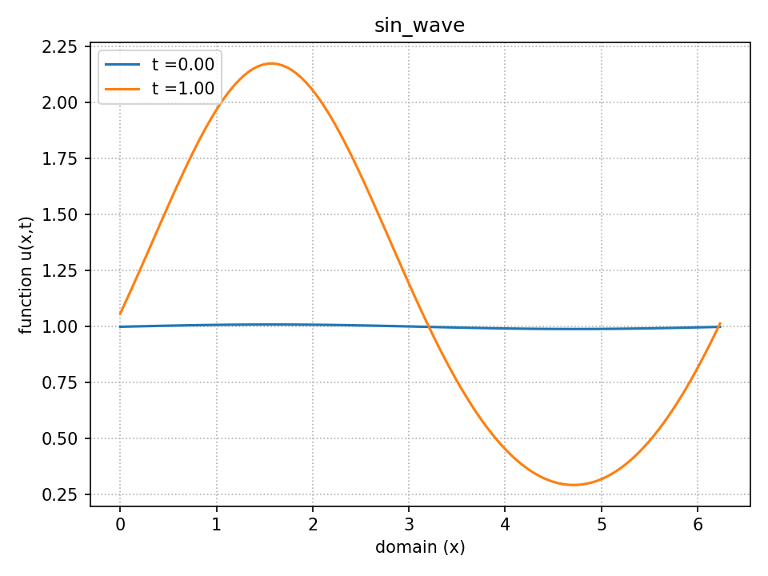
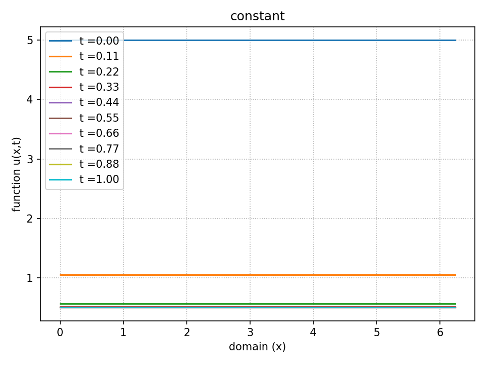
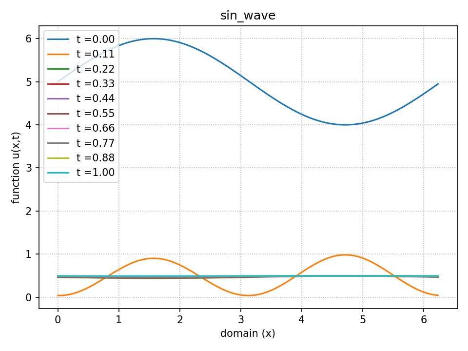
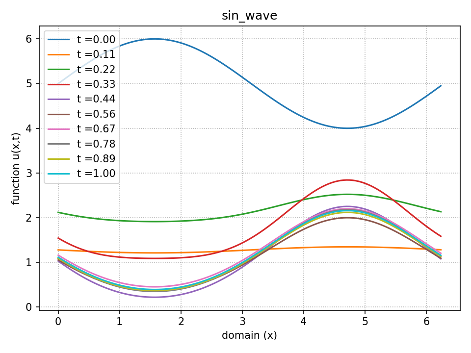

# Shear Dispersion Toy Equation

## Theory

This code solves a toy equation for sheear dispersion using Fourier-Galerkin spectral
methods for periodic boundary conditions

> c_t = nu c_xx + 2 c c_xxxx + c_xxxxxx + 4 c_x c_xxx + 1 - mu c

Let _c = c0 + d_, where d is a small perturbation about _c = c0_. Linearizing
about this base state gives

> d_t = nu d_xx + d_xxxxxx + 2 c0 d_xxxx - mu d

Now substitute the following form for the perturbation

> d = a_k(t) exp(i k x)

This gives us the following equation for the Fourier coefficients _ak(t)_

> a_k(t) = exp((2 c0 k^4 - nu k^2 - k^6 - mu)t)

If mu = 0 and nu = 1.0, we see that the system will be linearly unstable if

> 2 c0 k^4 - k^2 - k^6 > 0

A plot of the function _y = 2 c0 k^4 - k^2 - k^6_ tells us that, if _c0 < 1_
system will be stable and will become linearly unstable for a range of
wavenumbers if _c0>1_. This instability, propogated by the term c c_xxxx,
however, is arrested by terms c_xx and c_xxxxxx and the system
settles to a steady state. Simulations for such cases yield a solution that
starts to grow and then oscillates with decaying amplitude to a steady state. We
can approximate the wavenumber of the final steady state as follows

> d(a_k(t))/dt = (2 c0 k^4 - nu k^2 - k^6 - mu)exp((2 c0 k^4 - nu k^2 - k^6 -
> mu)t)

and therefore

> d(a_k(t))/dt = 0 if 2 c0 k^4 - nu k^2 - k^6 - mu = 0

For _c0 = 1_, _nu = 1_ and _mu = 0_ , we get _k = 1_. It can be seen that this
closely approximates the wavenumber for the final steady state obtained from the
code. Following figure demonstates the evolution of an initial condition
_c0=1+sin(x)_ for a long time.

## Numerical Formulation

We have evolved the Fourier coefficients of these terms in time using 
Adams-Bashforth 2 step method for the non-linear terms and the Adams-Moulton 2
step method for the linear terms.

## Some Results

A detailed analysis of the code will require a parametric study over the
parameter space (mu nu L). Here we will only present a small sample of this
space

Firstly, we note that a constant initial condition must be eventually decay to
1/mu. This can be seen in the following plot where we start with _c0=5_ and
system settles to _c0=0.5_

For the above plot, the parameter are _mu=2.0_, _nu=1.0_ and _L=2 pi_. Following
plot shows the evolution of another initial condition for the same set of
parameters. A large value of _mu_ causes a rapid decay of the solution

With a smaller value of mu, the decay is slower and the final condition is not
constant

## To Run The Code

* The root directory must contain
    -toy_pde.py
    -post_processing.py
    -postproc.py
    -data/

* Run the file `toy_pde.py` with desired parameter values. This will generate a set
of datafiles in the folder data/.

* In order to plot the results, run the file `postproc.py`.

User defined functions make_plot() and make_movie() generate the visualizations.
Details of the functions are given in the file `post_processing.py`